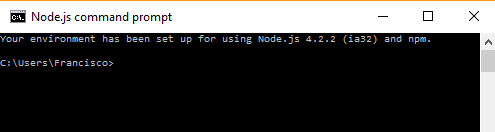
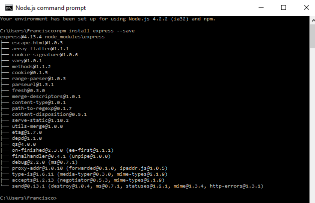
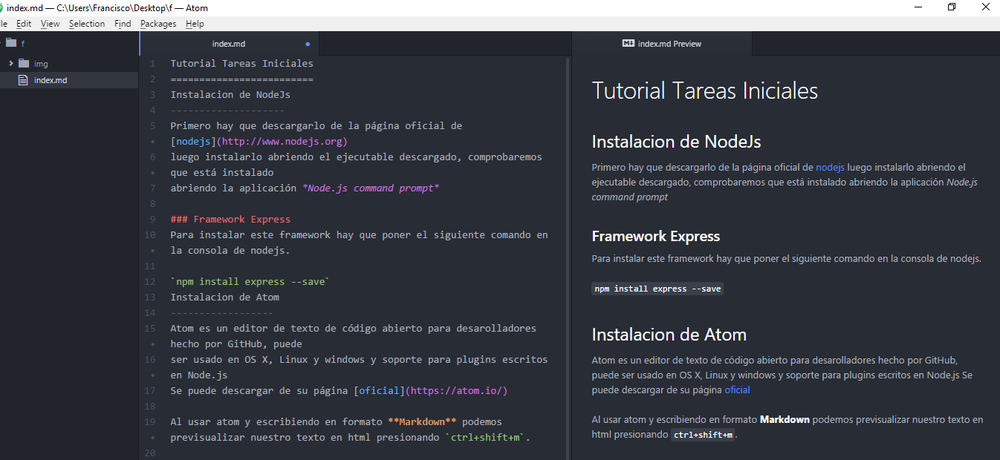
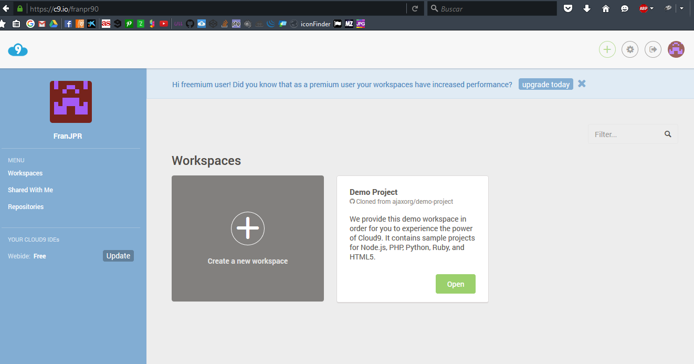
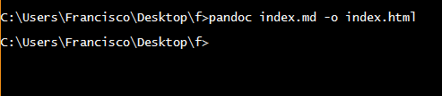

Tutorial Tareas Iniciales
=========================
Instalacion de NodeJs
--------------------
Primero hay que descargarlo de la página oficial de [nodejs](http://www.nodejs.org)
luego instalarlo abriendo el ejecutable descargado, comprobaremos que está instalado
abriendo la aplicación *Node.js command prompt*

### Framework Express
Para instalar este framework hay que poner el siguiente comando en la consola de nodejs.

`npm install express --save`

Instalacion de Atom
------------------
Atom es un editor de texto de código abierto para desarolladores hecho por GitHub, puede
ser usado en OS X, Linux y windows y soporte para plugins escritos en Node.js
Se puede descargar de su [página oficial](https://atom.io/)

Al usar atom y escribiendo en formato **Markdown** podemos previsualizar nuestro texto en html presionando `ctrl+shift+m`.

Instalar GitHub Desktop
----------------------
Descargar de la página de [GitHub](https://desktop.github.com/).

Una vez instalado deberas logearte con tu cuenta de github y apartir de ahí podras crear, clonar y otras tareas referentes a los repositorios de una manera muy intuitiva.

Cloud9
------
Es un IDE de desarrollo online, para su uso será necesario crear una cuenta en la [página oficial](http://9.io) o acceder con las credenciales de GitHub si ya se dispone de una cuenta. Una vez registrados podremos crear proyectos de varias tecnologías como puede ser NodeJS, HTML5, C++, Ruby On Rails, etc.

Markdown
--------
Markdown es un lenguaje de marcado ligero, lo vamos a utilizar en el editor de texto Atom ya que incorpora por defecto este formato y podremos obtener un live preview mientras vamos desarrollando además de poder exportarlo a HTML sin la necesidad de usar un conversor adicional.

Sintaxis:

Encabezados
#  Encabezado H1
## Encabezado H2
### Encabezado H3

Tipografía

    **Negrita**
    *Cursiva*
    > Citas
    Parrafo separar por lineas en blanco
    `Codigo`

Recursos

    
    [Enlace](https://www.enlace.com)

Listas

    1. Lista 1
    2. Lista 2

    * Lista 1
    * Lista 2

Instalar Pandoc
-------------
Descargarlo de la [página oficial](https://www.pandoc.org)
Pandoc es un traducto de archivos en formato Markdown**(.md)** a formato .HTML para ello en la consola escribimos *(estando en el directorio del fichero)*.

`pandoc input.md -o output.html`

 Usando GitPages
 ----------
 GitHub provee a cada usuario de un sitio para alojar su web.
 Colgaremos este Tutorial en nuestro gh-page.
 
